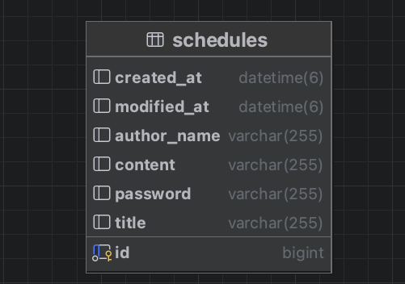

# Schedule Project

## 📖 목차
1. [프로젝트 소개](#프로젝트-소개)
2. [프로젝트 계기](#프로젝트-계기)
3. [주요기능](#주요기능)
4. [개발기간](#개발기간)
5. [기술스택](#기술스택)
6. [Trouble Shooting](#trouble-shooting)
7. [ERD](#ERD)
8. [API 명세](#API명세)
9. [과제 질문 답변](#과제질문답변)

## 👨‍🏫 프로젝트 소개
일정 관리 앱 프로젝트

## 소개
개인 프로젝트 / 내일배움캠프 과제

## 💜 주요기능
1. 일정 생성
2. 일정 조회
3. 일정 수정
4. 일정 삭제
5. 댓글 생성
6. 일정 단건 조회 시 일정 댓글들도 조회
7. 입력 검증

## ⏲️ 개발기간
- 2026.04.10(금) ~ 2026.04.13(월)

## 📚️ 기술스택

### ✔️ Language
java Spring

### ✔️ IDE
IntelliJ

## 트러블슈팅
벨로그 참고
https://velog.io/@khs0305/일정-관리-앱-만들기-트러블슈팅

## 🗂️ ERD
<details>
<summary>🗂️ <b>ERD 열기</b> </summary>



</details>

## API 명세

<details>
<summary>📌 <b>일정 생성 API</b> </summary>

### 일정 생성 API
- Method: POST
- URL: /schedules
- Request Body:
```json
{
  "title": "회의",
  "content": "팀 프로젝트 회의",
  "authorName": "홍길동",
  "password": "1234"
}
```
- Request 필드

| 필드명        | 타입     | 필수 여부 | 설명             |
| ---------- | ------ | ----- | -------------- |
| title      | String | O     | 일정 제목          |
| content    | String | O     | 일정 내용          |
| authorName | String | O     | 작성자 이름         |
| password   | String | O     | 일정 수정/삭제용 비밀번호 |

- Response
```json
{
  "id": 1,
  "title": "회의",
  "content": "팀 프로젝트 회의",
  "authorName": "홍길동",
  "createdAt": "2026-04-10T14:30:00",
  "updatedAt": "2026-04-10T14:30:00"
}
```
- Response 필드

  | 필드명        | 타입            | 설명     |
  | ---------- | ------------- | ------ |
  | id         | Long          | 일정 ID  |
  | title      | String        | 일정 제목  |
  | content    | String        | 일정 내용  |
  | authorName | String        | 작성자 이름 |
  | createdAt  | LocalDateTime | 생성일    |
  | updatedAt  | LocalDateTime | 수정일    |

- 상태 코드

| 상태 코드 | 설명                |
| ----- | ----------------- |
| 201   | 생성 성공             |
| 400   | 잘못된 요청 (필수값 누락 등) |
| 500   | 서버 오류             |
</details>
<details>
<summary>📌 <b>일정 조회 API</b> </summary>

### 전체 일정 조회 API
- Method: GET
- URL: /schedules
- Request Body:
```json
{
  "authorName": "홍길동"
}
```
- Request 필드

| 필드명        | 타입     | 필수 여부 | 설명             |
| ---------- | ------ |-------| -------------- |
| authorName | String | x     | 작성자 이름         |


- Response
```json
{
  "id": 1,
  "title": "회의",
  "content": "팀 프로젝트 회의",
  "authorName": "홍길동",
  "createdAt": "2026-04-10T14:30:00",
  "updatedAt": "2026-04-10T14:30:00"
}
```
- Response 필드

  | 필드명        | 타입            | 설명     |
    | ---------- | ------------- | ------ |
  | id         | Long          | 일정 ID  |
  | title      | String        | 일정 제목  |
  | content    | String        | 일정 내용  |
  | authorName | String        | 작성자 이름 |
  | createdAt  | LocalDateTime | 생성일    |
  | updatedAt  | LocalDateTime | 수정일    |

- 상태 코드

| 상태 코드 | 설명                |
|-------|-------------------|
| 200   | 성공                |
| 400   | 잘못된 요청 (필수값 누락 등) |
| 500   | 서버 오류             |

### 선택 일정 조회 API
- Method: GET
- URL: /schedules/{id}
- Request Body:
```json
{
  "id": 1
}
```
- Request 필드

| 필드명     | 타입    | 필수 여부 | 설명       |
| ------- | ----- |-------| -------- |
| id      | Long   | O     | 일정 ID   |


- Response
```json
{
  "id": 1,
  "title": "회의",
  "content": "팀 프로젝트 회의",
  "authorName": "홍길동",
  "createdAt": "2026-04-10T14:30:00",
  "updatedAt": "2026-04-10T14:30:00",
  "commencontent": "좋아요",
  "commentauthorName": "김철수",
  "commentcreatedAt": "2026-04-10T14:30:00",
  "commentupdatedAt": "2026-04-10T14:30:00"
}
```
- Response 필드

  | 필드명            | 타입            | 설명        |
      |----------------| ------------- |-----------|
  | id             | Long          | 일정 ID     |
  | title          | String        | 일정 제목     |
  | content        | String        | 일정 내용     |
  | authorName     | String        | 작성자 이름    |
  | createdAt      | LocalDateTime | 생성일       |
  | updatedAt      | LocalDateTime | 수정일       |
  | commentcontent | String        | 일정 댓글 내용  |
  | commentauthorName     | String        | 댓글 작성자 이름 |
  | commentcreatedAt      | LocalDateTime | 댓글 생성일    |
  | commentupdatedAt      | LocalDateTime | 댓글 수정일    |

- 상태 코드

| 상태 코드 | 설명                |
|-------|-------------------|
| 200   | 성공                |
| 400   | 잘못된 요청 (필수값 누락 등) |
| 500   | 서버 오류             |
</details>
<details>
<summary>📌 <b>일정 수정 API</b> </summary>

### 일정 수정 API
- Method: PATCH
- URL: /schedules/{id}
- Request Body:
```json
{
  "title": "회의",
  "authorName": "홍길동",
  "password": "1234"
}
```
- Request 필드

| 필드명        | 타입     | 필수 여부 | 설명             |
| ---------- | ------ | ----- |----------------|
| title      | String | O     | 수정할 일정 제목      |
| authorName | String | O     | 수정할 작성자 이름     |
| password   | String | O     | 일정 수정/삭제용 비밀번호 |

- Response
```json
{
  "id": 1,
  "title": "회의",
  "authorName": "홍길동",
  "createdAt": "2026-04-10T14:30:00",
  "updatedAt": "2026-04-10T14:30:00"
}
```
- Response 필드

  | 필드명        | 타입            | 설명         |
    | ---------- | ------------- |------------|
  | id         | Long          | 일정 ID      |
  | title      | String        | 수정된 일정 제목  |
  | authorName | String        | 수정된 작성자 이름 |
  | createdAt  | LocalDateTime | 생성일        |
  | updatedAt  | LocalDateTime | 수정일        |

- 상태 코드

| 상태 코드 | 설명                |
|-------| ----------------- |
| 200   | 성공             |
| 400   | 잘못된 요청 (필수값 누락 등) |
| 500   | 서버 오류             |
</details>

<details>
<summary>📌 <b>일정 삭제 API</b> </summary>

### 일정 삭제 API
- Method: DELETE
- URL: /schedules/{id}
- Request Body:
```json
{
  "password": "1234"
}
```
- Request 필드 : 없음

- 상태 코드

| 상태 코드 | 설명                |
|-------| ----------------- |
| 204   | 성공             |
| 400   | 잘못된 요청 (필수값 누락 등) |
| 500   | 서버 오류             |
</details>
<details>
<summary>📌 <b>댓글 생성 API</b> </summary>

### 댓글 생성 API
- Method: POST
- URL: /schedules/{id}
- Request Body:
```json
{
  "scheduleid" : 1,
  "content": "팀 프로젝트 회의",
  "authorName": "홍길동",
  "password": "1234"
}
```
- Request 필드

| 필드명        | 타입     | 필수 여부 | 설명             |
| ---------- |--------| ----- |----------------|
| scheduleid    | Long   | O     | 일정 id          |
| content    | String | O     | 댓글 내용          |
| authorName | String | O     | 작성자 이름         |
| password   | String | O     | 일정 수정/삭제용 비밀번호 |

- Response
```json
{
  "commentid": 1,
  "content": "팀 프로젝트 회의",
  "authorName": "홍길동",
  "createdAt": "2026-04-10T14:30:00",
  "updatedAt": "2026-04-10T14:30:00"
}
```
- Response 필드

  | 필드명        | 타입            | 설명     |
    | ---------- | ------------- |--------|
  | id         | Long          | 댓글 ID  |
  | content    | String        | 댓글 내용  |
  | authorName | String        | 작성자 이름 |
  | createdAt  | LocalDateTime | 생성일    |
  | updatedAt  | LocalDateTime | 수정일    |

- 상태 코드

| 상태 코드 | 설명                |
| ----- | ----------------- |
| 201   | 생성 성공             |
| 400   | 잘못된 요청 (필수값 누락 등) |
| 500   | 서버 오류             |
</details>

## 과제 질문 답변

1. 3 Layer Architecture(Controller, Service, Repository)를 적절히 적용했는지 확인해 보고, 왜 이러한 구조가 필요한지 작성해 주세요.

	3 Layer Architecture 구조가 필요한 이유는 계층을 분리하여 책임을 분리하기 위함이다.
	시스템이 복잡 할 수록 한 계층에 모든 기능을 구현하면 유지보수나, 책임분리의 제한사항이 많아진다.
	때문에 시스템 개발을 할때 유지보수, 책임분리, 확장성을 높이기 위해 사용된다.
	
	Controller : 클라이언트 요청을 받고, 적절한 Controller에 배정 Service에 전달한다. 이후 결과 값을 반환해준다.
	
	Service : 비지니스 로직을 수행하며, Repository와 데이터를 교환한다.
	
	Repository : DB와 데이터를 교환하며, Service에 값을 전달한다.


3. @RequestParam, @PathVariable, @RequestBody가 각각 어떤 어노테이션인지, 어떤 특징을 갖고 있는지 작성해 주세요.

	위의 어노테이션은 클라이언트에서 요청하는 URL과 바디를 가져오는 어노테이션이다.
	
	@RequestParam : URL의 쿼리 파라미터를 받는 것이다.
	사용예시) GET /schedules?authorName=현승
	
	@PathVariable : 기본키 id와 같은 특정{} 경로 값을 받아온다.
	
	@RequestBody : 요청Body문을 받아온다. DB 값을 생성, 수정, 검증 등에 사용된다.
